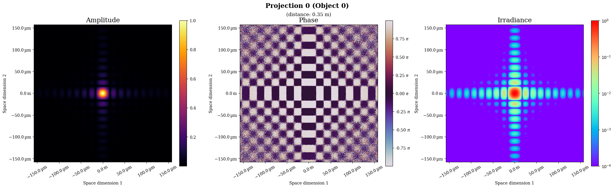
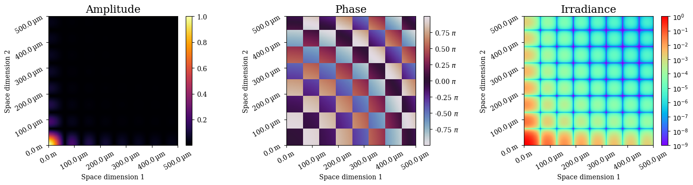
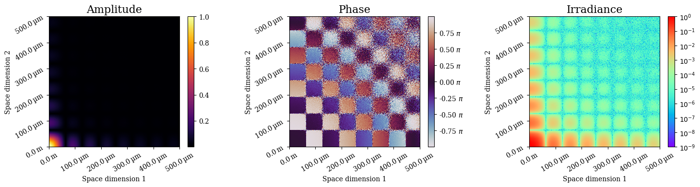
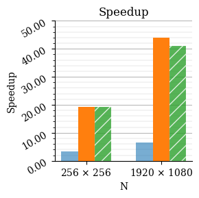
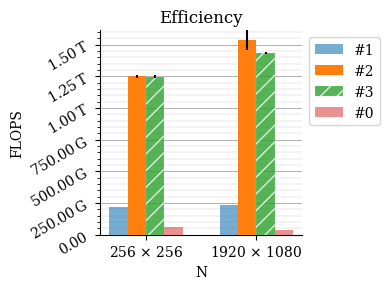
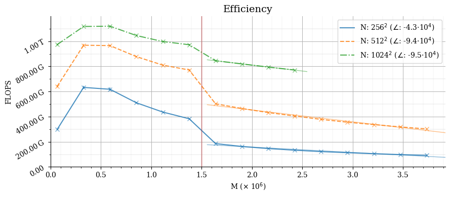
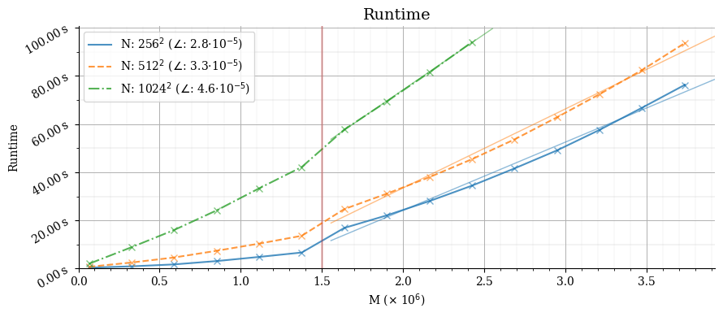
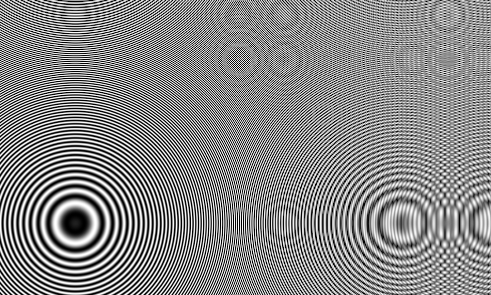
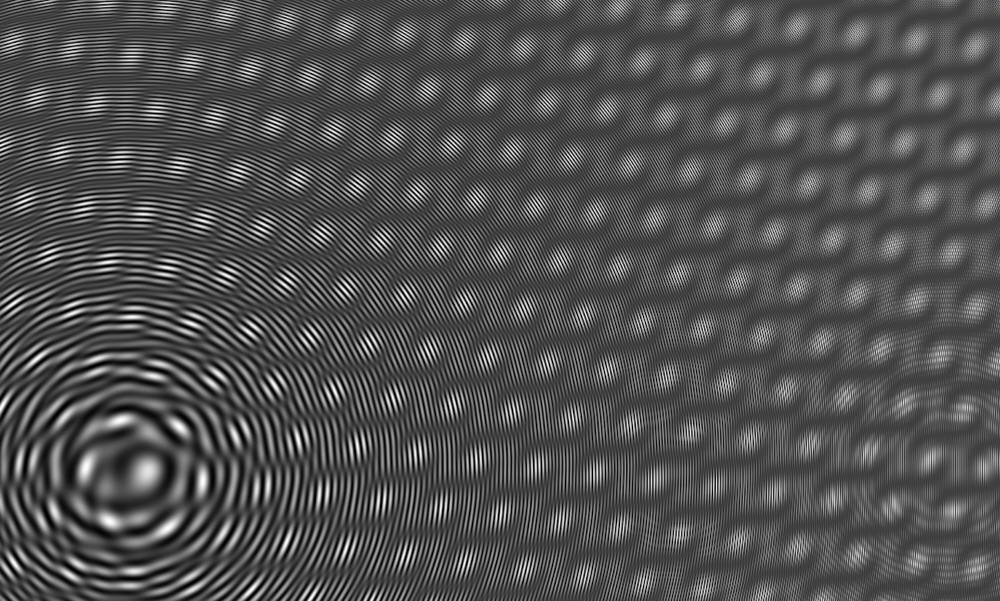

# Holographic-Projector

High performance simulations of [holographic](https://en.wikipedia.org/wiki/Holography) projectors for GPU's, using [CUDA](https://docs.nvidia.com/cuda/).
The implementations are explained in [this paper](https://link.springer.com/chapter/10.1007/978-3-030-77970-2_11
).

The main CLI application `cuda/holo` computes superpositions of multiple target positions w.r.t multiple source positions.


### Project structure

```sh
cuda # C++/CUDA code. Additionally the CUDA libraries cuBLAS, thrust and CUB are used.
matlab # Matlab scripts that can be used to run simulations.
py # legacy Python code which was used for prototyping. This does not require a GPU.
```

## Results




<details>
<summary><b>Quality</b></summary>
<br>
<p>A brute-force simulation.</p>

<p>A Monte Carlo simulation (approximation).</p>

</details>

### Performance

Three algorithms, in comparison to a baseline.



<details>
<summary><b>More</b></summary>
<br>

<br/>


</details>


### Setup & Dependenceis

The main dependencies are `nvcc` and `gcc`. Make sure they are installed and added to the path.
E.g. in case of Nikhef intranet:
```
/usr/local/cuda-11.0/bin
/cvmfs/sft.cern.ch/lcg/releases/gcc/*/bin
```
and optionally run
```
LD_LIBRARY_PATH=/cvmfs/sft.cern.ch/lcg/releases/gcc/8.3.0.1/x86_64-centos7/lib64:$LD_LIBRARY_PATH
```

### Usage

Compile the CUDA program using
```
make build
```
which is an alias for `nvcc -o holo main.cu -l curand -l cublas -std=c++14 -arch=compute_70 -code=sm_70`.
The compile-time constants can be changed by appending `-D{compile_time_constants}`.
Then you can run the CLI application using
```
cuda/holo
```
Run `cuda/holo -h` to list all valid arguments.


By default, the required source and target positions are generated automatically.
There are `3` types of distributions, and they are indicated using the symbols:
- `x` the original input distribution, with positions `u`.
- `y` the _projector_ distribution, with positions `v`.
- `z` the _projection_ distribution, with positions `w`. This distribution will represent the original input distribution.

Using `x` as source, a target distribution `y` can be computed. 
Then, using `y` as source, `z` can be computed.

Alternatively it is possible to use external data.
Use the flag `-f {directory}` to incdicate the name of the directory that contains the dataset files.
These files should be binary arrays for double-precision floating-point values (Little-endian encoding by default) and should be named as follows.
- `x0_amp.dat, x0_phase.dat`
- `u0.dat` (for the source data)
- `v0.dat` (for the _projector_ target positions)
- `w0_0.dat` (for the _projection_ target positions) - this file is only used if the boolean flag `-F` is supplied.

The projector distribution is written to `y0_amp.dat` and the projection distribution is written to `z0_0_amp.dat`.


---

Interference patterns of 1 an 5 points.






### Overview of CUDA code

The main kernel to compute superpositions is `superposition::per_block`, 
which repeatedly calls `superposition::phasor_displacement`.

The main files are `cuda/main.h,.cu`, in which functions declared in `cuda/transform.cu` are called to compute superposition transformations:

- a brute force transformation `transform_full()`

The are a number of variants of `SuperpositionPerBlockHelper` macros which are used in combination with `superposition_per_block_helper()` functions.
They allow the GPU geometry to be included as templates, which is required for CUB library functions.

Additionally `cuda/macros.h` contain macros and constants.

---

Various tests are included in `cuda/test.cu` and `cuda/test_gpu.cu`. 
There are no tests written for the MC estimators (`transform()`).

